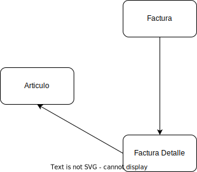
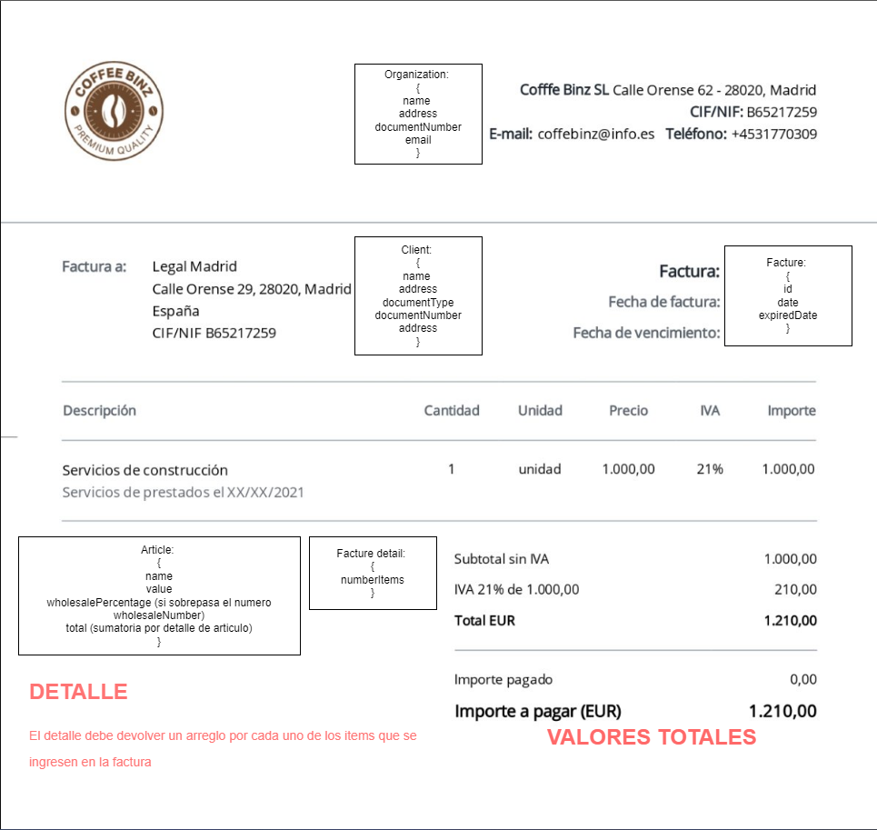

**Prueba Técnica - Programador**

*La siguiente es una prueba para evaluar a los postulantes a programador Back-end.*

---

## INTRODUCCIÓN

Este repositorio contiene una serie de requerimientos de un Caso Práctico, que busca evaluar las capacidades técnicas del candidato con respecto a las principales funciones y responsabilidades que se requieren dentro del área de Desarrollo de Tecnología en CS3.

¿Qué se busca evaluar?
Principalmente los siguientes aspectos:

1. Creatividad para resolver los requerimientos,
2. Calidad del código entregado (estructura y buenas prácticas),
3. Eficiencia de los algoritmos entregados,
4. Familiaridad con Frameworks y plataformas de desarrollo.
5. Principios SOLID (si conoce).

---

## IMPORTANTE

1. Recomendamos emplear un máximo de 2 dias y enviar todo lo que puedas.
2. Se requiere de una cuenta de Bitbucket para realizar este ejercicio.
3. Antes de comenzar a programar:
    - Realizar un Fork de este repositorio (https://bitbucket.org/cs3dev/backend-test).
    - Clonar el fork a su máquina local git clone https://cs3dev@bitbucket.org/cs3dev/FORKED-PROJECT.git
    - Crear un branch en su cuenta de Bitbucket utilizando su nombre completo.
    - Al finalizar, existen 2 (dos) opciones para entregar su proyecto:
    - Realizar un Commit de su proyecto, enviar un Pull Request al branch con su NOMBRE, y notificar a la siguiente dirección de correo electrónico lmartes@cs3.com.co.
    - Crear un archivo comprimido (.zip o .rar) de su proyecto y enviar a la siguiente dirección de correo electrónico lmartes@cs3.com.co.

---

## ENTREGA ESPERADA

1. Utilizar NestJS como framework para el desarrollo del backend (**Requerido**).
2. Implementar GraphQL para la creación de la API (**Opcional**, si no, se pueden realizar con controladores base de Nest).
3. Utilizar TypeScript para el desarrollo del código (**Requerido**).
4. Utilizar SQL Server como base de datos para almacenar los libros (**Opcional**, tambien se puede utilizar PostgreSQL u otro).
6. Utilizar Docker para contenerizar la aplicación (**Requerido**, los cambios se deberian poder subir a Docker Hub).

---

## ESTRUCTURA

Se desea administrar el sistema de compras y ventas de una tienda miscelanea, teniendo en cuenta que las compras no necesitan datos del comprador, los datos a registrar son solamente datos base de la factura, el detalle de la factura y la informacion de los productos.

### Organizacion (Nombre BD: organization)

| Field | Value | Null |
|---|---|---|
| id | uniqueidentifier | false |
| name | varchar(200) | false |
| email | varchar(50) | false |
| phone | varchar(50) | false |
| documentNumber | varchar(40) | false |
| address | varchar(400) | false |
| createdAt | datetime | false |
| updatedAt | datetime | false |
| deletedAt | datetime | true |

### Cliente (Nombre BD: client)

| Field | Value | Null |
|---|---|---|
| id | uniqueidentifier | false |
| name | varchar(200) | false |
| documentType | varchar(10) | false |
| documentNumber | varchar(40) | false |
| address | varchar(400) | false |
| createdAt | datetime | false |
| updatedAt | datetime | false |
| deletedAt | datetime | true |

### Factura (Nombre BD: facture)

| Field | Value | Null |
|---|---|---|
| id | uniqueidentifier | false |
| date | datetime | false |
| expiredDate | datetime | false |
| clientId | uniqueidentifier (forgein key, no primary) | false |
| createdAt | datetime | false |
| updatedAt | datetime | false |
| deletedAt | datetime | true |

### Articulo (Nombre BD: article)

| Field | Value | Null |
|---|---|---|
| id | uniqueidentifier | false |
| name | varchar(50) | false |
| value | decimal(10,3) | false |
| wholesaleNumber | int | true |
| wholesalePercentage | int | true |
| factureDetailId | uniqueidentifier (forgein key, no primary)  | false |
| createdAt | datetime | false |
| updatedAt | datetime | false |
| deletedAt | datetime | true |

### Factura Detalle (Nombre BD: factureDetail)

| Field | Value | Null |
|---|---|---|
| id | uniqueidentifier | false |
| articleId | uniqueidentifier (forgein key, no primary) | false |
| numberItems | int | false |
| createdAt | datetime | false |
| updatedAt | datetime | false |
| deletedAt | datetime | true |

---

## EJERCICIO

Luego de poder realizar un CRUD base de cada una de las tablas se desea:

*Tener en cuenta que el aplicativo debe tener las bases de autenticacion (Tabla Usuario) para poder ejecutar los servicios*

1. Devolver como servicio un resumen de la factura con totalizador de montos:

- Teniendo en cuenta los campos de la tabla Articulo (article) **wholesaleNumber** (numero al por mayor) y **wholesalePercentage** (porcentaje de descuento al por mayor) realizar los correspondientes calculos de descuento si algun numero de articulos de la tabla factura detalle sobrepase la cantidad definida al por mayor.
- De ser posible, devolver en la misma respuesta el arreglo de factura detalle.

2. Devolver como servicio las 5 facturas con mayor cantidad de objetos comprados.

3. Devolver como servicio las 5 facturas con mayor cantidad de montos finales.